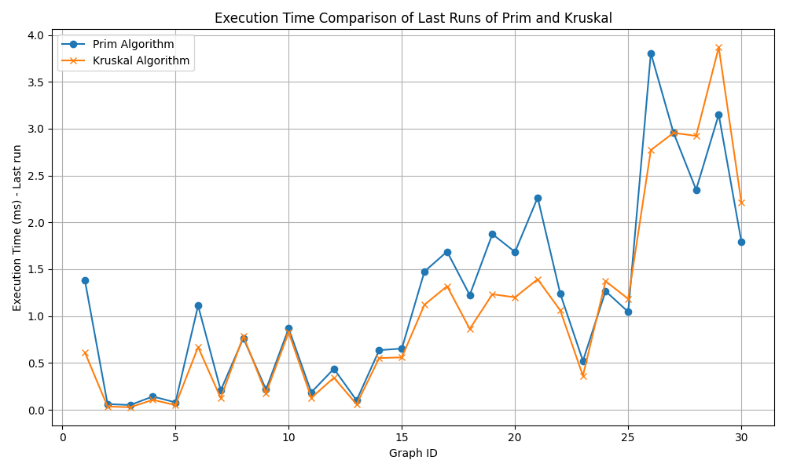

# MST Algorithms Analytical Report

Developed by: Mukashev Sultanbek

Group: SE-2422
## Overview

This project implements and benchmarks two well-known Minimum Spanning Tree (MST) algorithms — Prim’s and Kruskal’s — on a diverse set of weighted undirected graphs. The goal is to compare the algorithms’ efficiency and performance both theoretically and empirically.

### Key components:

Java implementations of Prim’s and Kruskal’s algorithms.

Benchmarking framework using multiple graph datasets to measure execution time, operation counts, and correctness.

Python scripts to analyze benchmark results and visualize execution performance comparison.

Detailed project documentation including test coverage and usage instructions.

The benchmarking covers 30 graphs with varying sizes and densities, allowing insights into algorithm behavior under different conditions.

## 1. Input Data & Algorithm Results
   The input dataset consists of 30 undirected weighted graphs of varying sizes and densities. For each graph, both Prim’s and Kruskal’s algorithms were run, collecting these metrics per final run:

| GraphID | Prim TotalCost | Prim Operations | Prim Exec. Time (ms) | Kruskal TotalCost | Kruskal Operations | Kruskal Exec. Time (ms) |
|---------|---------------|----------------|----------------------|-------------------|--------------------|-------------------------|
| 1       | 45.00 | 15 | 1.380 | 45.00 | 15 | 0.612 |
| 2       | 23.00 | 11 | 0.061 | 23.00 | 10 | 0.035 |
| 3       | 43.00 | 8 | 0.051 | 43.00 | 10 | 0.027 |
| 4       | 110.00 | 35 | 0.142 | 110.00 | 34 | 0.106 |
| 5       | 86.00 | 22 | 0.079 | 86.00 | 23 | 0.050 |
| ...     | ... | ... | ... | ... | ... | ... |
| 25      | 3269.00 | 2213 | 1.045 | 3269.00 | 2139 | 1.183 |
| 26      | 8559.00 | 5438 | 3.805 | 8559.00 | 5320 | 2.771 |
| 27      | 9140.00 | 6087 | 2.958 | 9140.00 | 5964 | 2.955 |
| 28      | 9241.00 | 5851 | 2.349 | 9241.00 | 5777 | 2.923 |
| 29      | 11976.00 | 8030 | 3.150 | 11976.00 | 8013 | 3.868 |
| 30      | 6618.00 | 4416 | 1.794 | 6618.00 | 4358 | 2.212 |

Results for all graphs are directly available in benchmark.csv, where each line documents a run’s algorithm, cost, operation count, and execution time.

## 2. Prim vs Kruskal: Efficiency and Performance
### Theory

Prim’s Algorithm chooses the lightest possible edge at each expansion step, using a priority queue to always connect a new minimum-weight edge to the MST. The classic implementation has

O((V+E)logV) complexity with Fibonacci heaps; binary heaps make it O(ElogV)

Kruskal’s Algorithm sorts all edges up front and then iteratively builds the MST by adding lightest edges, using Union-Find to prevent cycles. Complexity is
O(ElogE) due to initial edge sorting

### In Practice
Empirical results (see the chart below) show:

For small and moderately sized graphs, both algorithms yield identical MST costs and comparable operation counts.

Kruskal’s typically achieves lower or similar execution times for most graphs, especially on sparser graphs, while Prim’s can be slower as the graph size and density increase.

For larger graphs (GraphID 25 and above), Kruskal tends to offer slightly faster runtimes, but for some dense cases Prim matches or briefly outpaces Kruskal.

Both algorithms' theoretical and practical runtimes reflect their different approaches: Kruskal’s cost is dominated by sorting, while Prim’s by heap operations.

## 3. Conclusions: Which Algorithm When?
**Sparse Graphs:** Kruskal’s algorithm generally performs better because its efficiency is closely tied to the number of edges; sorting is fast when edges are few.

**Dense Graphs:** Prim’s algorithm with an efficient heap can outperform Kruskal, since dealing with all edges (as in Kruskal's sort) becomes expensive as density rises.

**Edge Representation:** Kruskal is easier with edge list; Prim is more efficient when an adjacency list is available.

**Implementation:** Kruskal’s is conceptually simpler but Union-Find can be tricky; Prim’s benefits greatly from good priority queue design and is usually quicker for dense graphs when using an adjacency list.

In this benchmark, both algorithms always found the correct MST, but Kruskal typically completed slightly faster except for several dense graphs.

